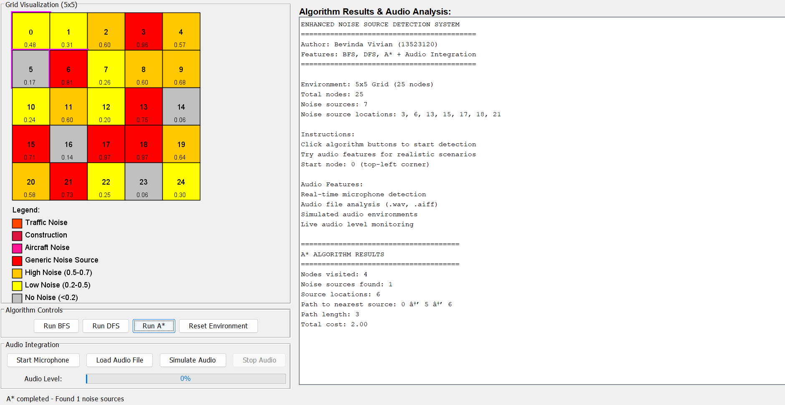

# Noise Source Detection Using BFS, DFS, and A* Graph Traversal Algorithms
<p align="center">
  
</p>

**Author:** Bevinda Vivian (13523120)  
**Program Studi:** Teknik Informatika ITB

---

## Deskripsi

Implementasi sistem deteksi sumber kebisingan menggunakan tiga algoritma graph traversal untuk mencari jalur terdekat ke sumber suara:

1. **BFS (Breadth-First Search)** - Pencarian melebar
2. **DFS (Depth-First Search)** - Pencarian mendalam  
3. **A* Algorithm** - Algoritma optimal dengan heuristik

Program mensimulasikan grid 5x5 dengan noise sources yang dideteksi secara otomatis.

---

##  Cara Menjalankan
Clone github ini
```
https://github.com/bevindav/noise-source-detection
```
Pastikan terminal sudah berada di folder src seperti C:\Users\Bevinda\Downloads\noise-source-detection\src

###  Versi GUI (Recommended):
```powershell
javac -d ../bin NoiseDetectionGUI.java 2>&1
java -cp ../bin NoiseDetectionGUI
```

###  Versi CLI:
```powershell
javac -d ../bin NoiseSourceDetection.java 2>&1
java -cp ../bin NoiseSourceDetection
```


---

## File Structure

```
noise-source-detection/
├──/src
├──── NoiseSourceDetection.java    
├──── NoiseDetectionGUI.java       
├──/bin
├──── classes from compiled java
└── README.md                   
```

---

## Fitur
### GUI Version (Swing):
- **Visual Grid** dengan color-coded noise levels
- **Interactive Buttons** untuk menjalankan algoritma
- **Real-time Visualization** dari path yang ditemukan
- **Detailed Results Panel** dengan scrollable output
- **Environment Reset** untuk generate grid baru
- **Color Legend** untuk memahami noise levels
- **Path Highlighting** dengan warna berbeda per algoritma
- **Audio Integrated** dapat mendengarkan suara secara langsung dari microphone atau mengupload file wav
### CLI Version:
- **Grid 5x5** dengan noise sources acak
- **Visualisasi ASCII** dari grid environment
- **Implementasi lengkap** BFS, DFS, dan A*
- **Perbandingan algoritma** (nodes visited, path length, cost)
- **Path tracking** ke noise source terdekat
- **Pure Java** - tanpa dependencies eksternal

---

## Sample CLI Output

```
======================================================================
NOISE SOURCE DETECTION SYSTEM
Using BFS, DFS, and A* Graph Traversal Algorithms
Author: Bevinda Vivian (13523120)
======================================================================

Initializing 5x5 grid environment...
Environment created with 25 nodes
Noise sources at nodes: [6, 12, 18]

Grid Visualization (5x5):
Legend: [N] = Noise Source, [*] = High Noise, [.] = Low Noise, [ ] = No Noise

[ ] [ ] [ ] [ ] [ ] 
[ ] [N] [ ] [ ] [ ] 
[ ] [ ] [N] [ ] [ ] 
[ ] [ ] [ ] [N] [ ] 
[ ] [ ] [ ] [ ] [ ] 

Starting detection from node 0
======================================================================

1. BREADTH-FIRST SEARCH (BFS)
BFS: Found noise source at node 6 with noise level 0.8234
BFS: Found noise source at node 12 with noise level 0.9123
BFS: Found noise source at node 18 with noise level 0.8756

BFS Algorithm Results:
Found 3 noise sources: [6, 12, 18]
Path to nearest noise source: 0 -> 1 -> 6
BFS Stats: Visited=7, PathLength=3, SourcesFound=3

======================================================================

2. DEPTH-FIRST SEARCH (DFS)
DFS: Found noise source at node 6 with noise level 0.8234
DFS: Found noise source at node 12 with noise level 0.9123
DFS: Found noise source at node 18 with noise level 0.8756

DFS Algorithm Results:
Found 3 noise sources: [6, 12, 18]
Path to nearest noise source: 0 -> 5 -> 6
DFS Stats: Visited=25, PathLength=3, SourcesFound=3

======================================================================

3. A* ALGORITHM
A*: Found noise source at node 6 with noise level 0.8234 (cost: 2.00)

A* Algorithm Results:
Found 1 noise sources: [6]
Path to nearest noise source: 0 -> 1 -> 6
A* Stats: Visited=7, PathLength=3, SourcesFound=1, TotalCost=2.00

======================================================================

ALGORITHM COMPARISON SUMMARY
======================================================================
Algorithm    | Visited  | Path Len   | Sources Found | Cost    
----------------------------------------------------------------------
BFS          | 7        | 3          | 3            | N/A     
DFS          | 25       | 3          | 3            | N/A     
A*           | 7        | 3          | 1            | 2.00    

======================================================================
NOISE SOURCE DETECTION COMPLETED
© 2025 Bevinda Vivian (13523120) - Teknik Informatika ITB
======================================================================
```

---

## Algoritma Details

### BFS (Breadth-First Search)
- **Kompleksitas:** O(V + E)
- **Karakteristik:** Eksplorasi level-by-level, menjamin jalur terpendek
- **Implementasi:** Queue-based traversal

### DFS (Depth-First Search)  
- **Kompleksitas:** O(V + E)
- **Karakteristik:** Eksplorasi depth-first, memory efficient
- **Implementasi:** Recursive traversal

### A* Algorithm
- **Kompleksitas:** O(b^d)
- **Karakteristik:** Optimal pathfinding dengan heuristik
- **Implementasi:** Priority queue dengan f(n) = g(n) + h(n)

---

## Requirements

- **Java JDK 8+** (untuk compile dan run)
- **Windows Command Prompt/PowerShell** (untuk menjalankan scripts)

---


**Mata Kuliah:** Strategi Algoritma
**Topik:** BFS, DFS, A*
---

**© 2025 Bevinda Vivian (13523120) - Noise Source Detection**

---

## GUI Version Features

### Grid Visualization:
- **Red squares**: Noise Sources (noise level > 0.7)
- **Orange squares**: High Noise (0.5 - 0.7)
- **Yellow squares**: Low Noise (0.2 - 0.5)
- **Gray squares**: No Noise (< 0.2)

### Interactive Controls:
- **Run BFS**: Execute BFS algorithm with blue path highlighting
- **Run DFS**: Execute DFS algorithm with green path highlighting  
- **Run A***: Execute A* algorithm with magenta path highlighting
- **Reset Environment**: Generate new random grid configuration

### Results Panel:
- Environment information display
- Algorithm execution results
- Path visualization details
- Performance comparison metrics

### GUI Benefits:
- **Visual Learning**: See how algorithms traverse the grid
- **Interactive Experience**: Click buttons to run algorithms
- **Path Comparison**: Different colors show different algorithm paths
- **Immediate Feedback**: Results displayed in real-time
- **Easy Reset**: Generate new test cases instantly
